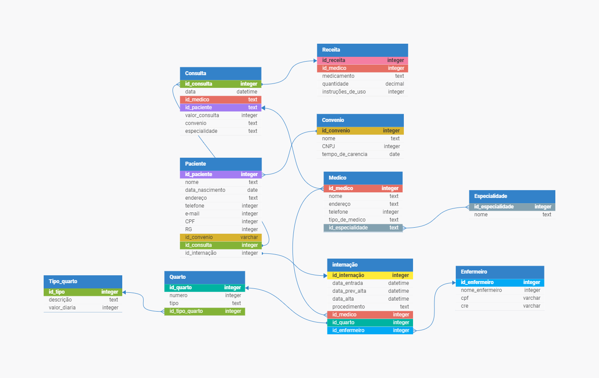

# O-Hospital-Fundamental
{PARTE1} 

Um hospital local está desenvolvendo um novo sistema para substituir planilhas e arquivos antigos. Eles precisam de um diagrama entidade-relacionamento para estruturar seu banco de dados.

# Os-Segredos-do-Hospital
{PARTE2} 

Após a primeira versão do projeto de banco de dados para o sistema hospitalar, notou-se a necessidade de expansão das funcionalidades, incluindo alguns requisitos essenciais a essa versão do software. As funcionalidades em questão são para o controle na internação de pacientes. Será necessário expandir o Modelo ER desenvolvido e montar o banco de dados, criando as tabelas para o início dos testes.

# Alimentando-o-Banco-de-Dados
{PARTE3} 

Com o banco de dados para o sistema hospitalar completamente montado, é necessário incluir dados para realizar os devidos testes e validar sua viabilidade quanto ao sistema. Nesta etapa, também é importante realizar a separação de alguns scripts iniciais para o banco, com os dados que serão necessários a um povoamento inicial do sistema.

Você pode encontrar os scripts SQL na pasta [Hospital_sql](Hospital_sql/Hospital_2.sql).

 # Alterando-o-Banco-de-Dados
{PARTE4} 

Um banco de dados pode sofrer alterações ao longo da sua concepção e do seu desenvolvimento. Nesse momento devemos nos preparar para atualizar nossas estratégias. 

Você pode encontrar os scripts SQL na pasta [Hospital_sql](Hospital_sql/Hospital_alterado.sql).

